# 🚀 Production DevOps Workflow Simulation

## 🏢 Experience Real Production Environment

This project simulates the **exact workflow used by companies like Netflix, Spotify, and Airbnb**. You'll work through every step of the software delivery lifecycle, from initial setup to production deployment and incident response.

---

## 🎯 Complete Production Workflow

### 📋 Day 0: Infrastructure Setup (Platform Team)

**What happens in real companies**: Platform/DevOps team sets up the infrastructure before developers start working.

#### 🤖 Automated Approach (Recommended)
```bash
# One command sets up entire production environment
./quick-start.sh
```

#### 👨‍💻 Manual Approach (Step-by-Step Learning)
```bash
# Step 1: Install infrastructure tools
sudo ./1-install-all.sh

# Step 2: Create production-grade cluster
./2-start-services.sh

# Step 3: Setup CI/CD pipeline
./3-create-pipeline.sh

# Step 4: Deploy monitoring stack
# (Included in step 2)

# Step 5: Verify everything works
./5-test-everything.sh
```

**Real-world equivalent**: AWS/GCP infrastructure provisioning, EKS/GKE cluster setup, Jenkins/GitLab CI setup.

---

### 📋 Day 1: Developer Onboarding

**What happens**: New developer joins the team and needs to understand the system.

#### 🔍 Explore the Production Environment
```bash
# Check what's running in production
./check-status.sh

# Access production dashboards
# Grafana: http://YOUR_IP:30091 (admin/admin123)
# Jenkins: http://YOUR_IP:8080 (admin/password-from-file)
# ArgoCD: http://YOUR_IP:30080 (admin/password-from-file)
```

#### 📊 Understand the Application Architecture
```bash
# View running services
kubectl get all -n dev
kubectl get all -n prod

# Check application logs
kubectl logs -f deployment/flask-app -n dev

# Access the application
kubectl port-forward svc/flask-app-service 8080:80 -n dev
# Visit: http://localhost:8080
```

**Real-world equivalent**: Developer gets access to AWS console, Kubernetes dashboard, monitoring tools.

---

### 📋 Day 2-5: Feature Development Cycle

**What happens**: Developer works on a new feature following production practices.

#### 🎯 Scenario: Add User Registration Feature

**Step 1: Create Feature Branch**
```bash
# In real companies, developers work on feature branches
git checkout -b feature/user-registration
```

**Step 2: Develop the Feature**
```bash
# Edit the Flask application
nano app/main.py

# Add new endpoint:
@app.route('/api/register', methods=['POST'])
def register_user():
    data = request.get_json()
    # Simulate user registration
    return {'message': 'User registered successfully', 'user_id': 123}

# Update tests
nano tests/test_app.py

# Add test for new endpoint:
def test_register_user():
    response = client.post('/api/register', 
                          json={'username': 'test', 'email': 'test@example.com'})
    assert response.status_code == 200
```

**Step 3: Local Testing (Manual)**
```bash
# Test only the changes locally
./4-deploy-flask.sh test-only

# Build and test container locally
./4-deploy-flask.sh build-only
```

**Step 4: Deploy to Development Environment**
```bash
# Deploy to dev environment for testing
./4-deploy-flask.sh

# Verify deployment
./check-status.sh apps

# Test the new feature
kubectl port-forward svc/flask-app-service 8080:80 -n dev
curl -X POST http://localhost:8080/api/register \
  -H "Content-Type: application/json" \
  -d '{"username":"testuser","email":"test@example.com"}'
```

**Real-world equivalent**: Developer pushes to feature branch, CI runs tests, deploys to dev environment.

---

### 📋 Day 6: Code Review & Integration

**What happens**: Code review process and integration to main branch.

#### 🔍 Code Review Process
```bash
# In real companies, this happens in GitHub/GitLab
git add .
git commit -m "Add user registration feature"
git push origin feature/user-registration

# Create Pull Request (simulated)
echo "Pull Request: Add user registration feature" > PR-123.md
```

#### 🧪 Automated Testing (CI Pipeline)
```bash
# Simulate automated CI pipeline trigger
# In Jenkins: http://YOUR_IP:8080/job/devops-flask-pipeline/

# Manual trigger for demonstration
curl -X POST http://YOUR_IP:8080/job/devops-flask-pipeline/build \
  --user admin:$(cat jenkins-credentials.txt | cut -d' ' -f4)
```

**Pipeline automatically does**:
1. 🧪 Runs unit tests
2. 🐳 Builds Docker image
3. 🛡️ Security vulnerability scan
4. 🚀 Deploys to staging environment
5. ✅ Runs integration tests

#### 🔄 Merge to Main Branch
```bash
# After approval, merge to main
git checkout main
git merge feature/user-registration
git push origin main
```

**Real-world equivalent**: GitHub PR review, automated CI/CD pipeline, merge to main branch.

---

### 📋 Day 7: Production Deployment

**What happens**: Deploying approved changes to production environment.

#### 🚀 Automated Production Deployment (GitOps)
```bash
# ArgoCD automatically detects changes and deploys
# Check ArgoCD: http://YOUR_IP:30080

# Monitor deployment status
kubectl get pods -n prod -w

# Verify deployment
./check-status.sh
```

#### 👨‍💻 Manual Production Deployment (If needed)
```bash
# Deploy to production namespace
kubectl apply -f k8s/prod/

# Monitor rollout
kubectl rollout status deployment/flask-app -n prod

# Verify production deployment
kubectl port-forward svc/flask-app-service 8081:80 -n prod
curl http://localhost:8081/api/register
```

#### 📊 Post-Deployment Monitoring
```bash
# Check application metrics
# Grafana: http://YOUR_IP:30091
# Prometheus: http://YOUR_IP:30090

# Monitor application logs
kubectl logs -f deployment/flask-app -n prod

# Check for any alerts
kubectl get events -n prod --sort-by=.metadata.creationTimestamp
```

**Real-world equivalent**: Production deployment via GitOps, monitoring dashboards, alerting systems.

---

### 📋 Day 8: Production Monitoring & Operations

**What happens**: Daily operations, monitoring, and maintenance.

#### 📈 Daily Health Checks
```bash
# Morning health check routine
./check-status.sh quick

# Check resource usage
kubectl top nodes
kubectl top pods --all-namespaces

# Review overnight alerts (simulated)
echo "Checking Grafana for any alerts or anomalies..."
```

#### 🔍 Performance Analysis
```bash
# Analyze application performance
kubectl port-forward svc/prometheus-kube-prometheus-prometheus 9090:9090 -n monitoring

# Key metrics to check:
# - Response time: http_request_duration_seconds
# - Error rate: http_requests_total{status=~"5.."}
# - Throughput: rate(http_requests_total[5m])
# - Resource usage: container_memory_usage_bytes
```

#### 🛡️ Security Monitoring
```bash
# Run security scans
trivy image devops-flask-app:latest

# Check for vulnerabilities in running containers
trivy k8s --report summary cluster
```

**Real-world equivalent**: Daily standup reviews, monitoring dashboards, security scans, performance analysis.

---

### 📋 Day 9: Incident Response Simulation

**What happens**: Simulating a production incident and response.

#### 🚨 Incident: High Memory Usage Alert

**Step 1: Incident Detection**
```bash
# Simulate high memory usage
kubectl patch deployment flask-app -n prod -p='{"spec":{"template":{"spec":{"containers":[{"name":"flask-app","resources":{"requests":{"memory":"1Gi"},"limits":{"memory":"1Gi"}}}]}}}}'

# Monitor the incident
kubectl get pods -n prod -w
./check-status.sh apps
```

**Step 2: Incident Investigation**
```bash
# Check pod status
kubectl describe pods -n prod -l app=flask-app

# Check logs for errors
kubectl logs -f deployment/flask-app -n prod --tail=100

# Check resource usage
kubectl top pods -n prod
```

**Step 3: Immediate Response**
```bash
# Scale up to handle load
kubectl scale deployment flask-app --replicas=3 -n prod

# Or rollback to previous version if needed
kubectl rollout undo deployment/flask-app -n prod

# Monitor recovery
kubectl rollout status deployment/flask-app -n prod
```

**Step 4: Post-Incident Review**
```bash
# Document the incident
echo "Incident Report: High memory usage resolved by scaling" > incident-report.md

# Update monitoring thresholds
# (Edit monitoring/prometheus-config.yaml)

# Implement preventive measures
# (Update resource limits in k8s/prod/deployment.yaml)
```

**Real-world equivalent**: PagerDuty alert, incident response team, rollback procedures, post-mortem analysis.

---

### 📋 Day 10: Scaling & Optimization

**What happens**: Optimizing the system based on production data.

#### 📊 Performance Optimization
```bash
# Analyze performance metrics
kubectl port-forward svc/prometheus-grafana 3000:80 -n monitoring

# Based on metrics, optimize application
# 1. Adjust resource limits
kubectl edit deployment flask-app -n prod

# 2. Implement horizontal pod autoscaling
kubectl autoscale deployment flask-app --cpu-percent=70 --min=2 --max=10 -n prod

# 3. Verify autoscaling
kubectl get hpa -n prod
```

#### 🔄 Infrastructure Improvements
```bash
# Add new monitoring dashboard
# (Edit monitoring/grafana-dashboard.json)

# Update CI/CD pipeline for better testing
# (Edit jenkins/Jenkinsfile)

# Implement blue-green deployment
# (Create new deployment strategy)
```

**Real-world equivalent**: Performance tuning, auto-scaling configuration, infrastructure optimization.

---

### 📋 Day 11-30: Continuous Operations

**What happens**: Ongoing operations, maintenance, and improvements.

#### 🔄 Weekly Maintenance Routine
```bash
# Monday: System health check
./5-test-everything.sh

# Tuesday: Security updates
trivy image --severity HIGH,CRITICAL devops-flask-app:latest

# Wednesday: Performance review
# Check Grafana dashboards for trends

# Thursday: Backup verification
# (In real systems: database backups, configuration backups)

# Friday: Capacity planning
kubectl top nodes
kubectl describe nodes
```

#### 🚀 Continuous Improvement
```bash
# Implement new features following the same workflow
# Day 2-7 process repeats for each new feature

# Infrastructure improvements
# - Add new environments (staging, QA)
# - Implement disaster recovery
# - Enhance monitoring and alerting
```

**Real-world equivalent**: Sprint planning, continuous delivery, infrastructure evolution, team retrospectives.

---

## 🎯 Production Scenarios You'll Experience

### 🏗️ Infrastructure Management
- **Cluster provisioning** and configuration
- **Multi-environment** setup (dev, staging, prod)
- **Resource management** and optimization
- **Security** and compliance implementation

### 👨‍💻 Development Workflow
- **Feature branch** development
- **Code review** process
- **Automated testing** and quality gates
- **Continuous integration** and deployment

### 🚀 Deployment Operations
- **Blue-green deployments**
- **Canary releases**
- **Rollback procedures**
- **Zero-downtime deployments**

### 📊 Monitoring & Observability
- **Application performance** monitoring
- **Infrastructure metrics** tracking
- **Log aggregation** and analysis
- **Alerting** and incident response

### 🚨 Incident Management
- **Alert handling** and escalation
- **Root cause analysis**
- **Disaster recovery**
- **Post-mortem** and improvements

---

## 🛠️ Tools You'll Master (Production-Grade)

| Category | Tool | Real-World Usage |
|----------|------|------------------|
| **Containers** | Docker | Application packaging and deployment |
| **Orchestration** | Kubernetes | Container orchestration and scaling |
| **CI/CD** | Jenkins | Automated build and deployment pipelines |
| **GitOps** | ArgoCD | Git-based deployment and configuration management |
| **Monitoring** | Prometheus + Grafana | Metrics collection and visualization |
| **Security** | Trivy | Vulnerability scanning and compliance |
| **Infrastructure** | Kind | Local Kubernetes development |

---

## 🎓 Learning Outcomes

After completing this simulation, you'll understand:

### 🏢 **Production Operations**
- How real companies deploy software
- DevOps best practices and methodologies
- Infrastructure as Code principles
- Site Reliability Engineering (SRE) practices

### 🔧 **Technical Skills**
- Kubernetes cluster management
- CI/CD pipeline design and implementation
- Monitoring and alerting setup
- Security scanning and compliance

### 🚨 **Operational Excellence**
- Incident response procedures
- Performance optimization techniques
- Capacity planning and scaling
- Disaster recovery planning

### 📈 **Career Preparation**
- Real-world DevOps experience
- Production environment exposure
- Industry-standard tool proficiency
- Problem-solving and troubleshooting skills

This simulation provides **hands-on experience** with the exact workflows, tools, and practices used in production environments at top technology companies.

---

## ⚡ Quick Start Options

### 🚀 Option 1: Experience Full Production Workflow (Recommended)
```bash
# Start the complete production simulation
chmod +x *.sh && ./quick-start.sh
```

### 🎯 Option 2: Step-by-Step Learning
```bash
# Follow the Day 0-30 workflow above with individual scripts
sudo ./1-install-all.sh    # Day 0: Infrastructure setup
./2-start-services.sh      # Day 0: Start all services
./3-create-pipeline.sh     # Day 0: Create CI/CD pipeline
./4-deploy-flask.sh        # Day 2-5: Deploy applications
./5-test-everything.sh     # Day 6: Run comprehensive tests
./check-status.sh          # Day 8+: Daily monitoring
```

### 👨‍💻 Option 3: Manual Deep Dive
Follow the detailed manual instructions in each day's workflow above.

---

## 🛠️ Script Reference for Production Workflow

| Script | Production Phase | Real-World Equivalent |
|--------|------------------|----------------------|
| `quick-start.sh` | 🏗️ Complete environment setup | Infrastructure provisioning |
| `1-install-all.sh` | 📦 Platform preparation | Tool installation & configuration |
| `2-start-services.sh` | 🚀 Service deployment | Cluster creation & service startup |
| `3-create-pipeline.sh` | 🔧 CI/CD setup | Pipeline configuration |
| `4-deploy-flask.sh` | 🌐 Application deployment | Feature deployment |
| `5-test-everything.sh` | 🧪 Quality assurance | System validation |
| `check-status.sh` | 📊 Operations monitoring | Daily health checks |
| `6-cleanup.sh` | 🧹 Environment cleanup | Resource decommissioning |

### 🏭 What This Project Does

```mermaid
graph TB
    subgraph "What You Do"
        A[👨‍💻 Write Code] --> B[📤 Push to Git]
    end
    
    subgraph "What Happens Automatically"
        B --> C[🔧 Jenkins Tests Your Code]
        C --> D[🐳 Builds Docker Container]
        D --> E[🛡️ Scans for Security Issues]
        E --> F[🚀 Deploys to Kubernetes]
    end
    
    subgraph "What You Get"
        F --> G[🌐 Working Web App]
        F --> H[📊 Monitoring Dashboard]
        F --> I[🔄 Easy Updates]
    end
```



This project includes:
- **Flask Web App** - A simple Python website with database
- **Automated Testing** - Code gets tested before deployment
- **Security Scanning** - Finds vulnerabilities automatically  
- **Container Deployment** - Apps run in isolated containers
- **Monitoring** - See how your app is performing
- **Easy Rollback** - Undo bad deployments quickly

## 🏗️ Complete System Architecture

```mermaid
graph TB
    subgraph "Development Phase"
        DEV[👨‍💻 Developer] --> CODE[📝 Write Code]
        CODE --> GIT[📁 Git Push]
    end
    
    subgraph "CI/CD Pipeline (Jenkins)"
        GIT --> JENKINS[🔧 Jenkins Detects Changes]
        JENKINS --> TEST[🧪 Run Unit Tests]
        TEST --> BUILD[🐳 Build Docker Image]
        BUILD --> SCAN[🛡️ Security Scan with Trivy]
        SCAN --> DEPLOY[🚀 Deploy to Kubernetes]
    end
    
    subgraph "Application Stack"
        DEPLOY --> FLASK[🌐 Flask Web App<br/>Python Backend]
        DEPLOY --> DB[🗄️ PostgreSQL<br/>Database]
        DEPLOY --> CACHE[⚡ Redis<br/>Cache Layer]
    end
    
    subgraph "GitOps & Monitoring"
        ARGOCD[🔄 ArgoCD<br/>GitOps Controller] --> DEPLOY
        PROMETHEUS[📊 Prometheus<br/>Metrics Collection] --> GRAFANA[📈 Grafana<br/>Dashboards]
        FLASK --> PROMETHEUS
        ALERTMANAGER[🚨 AlertManager<br/>Notifications] --> PROMETHEUS
    end
    
    subgraph "Infrastructure"
        K8S[☸️ Kubernetes Cluster<br/>Container Orchestration]
        DOCKER[🐳 Docker<br/>Container Runtime]
        KIND[🎯 Kind<br/>Local K8s Cluster]
    end
```



## ⚡ Three Ways to Set Up This Project

### 🚀 Option 1: Super Quick Setup (One Command!)

```bash
# One command does everything - perfect for beginners!
chmod +x *.sh && ./quick-start.sh
```

**That's it!** Complete DevOps pipeline ready in 10-15 minutes with guided setup.

### 🎯 Option 2: Step-by-Step Setup (Recommended for Learning)

```bash
# Step 1: Install all software (Docker, Kubernetes, Jenkins, etc.)
chmod +x *.sh
sudo ./1-install-all.sh

# Step 2: Start Kubernetes cluster and all services
./2-start-services.sh

# Step 3: Create and configure Jenkins CI/CD pipeline
./3-create-pipeline.sh

# Step 4: Deploy Flask application to Kubernetes
./4-deploy-flask.sh

# Step 5: Test everything is working
./5-test-everything.sh

# Check status anytime
./check-status.sh
```

### 👨‍💻 Option 3: Manual Setup (Deep Learning Experience)

Follow the detailed manual instructions below to understand what each component does.

---

## 🛠️ Complete Script Reference

| Script | Purpose | When to Use |
|--------|---------|-------------|
| `quick-start.sh` | 🚀 One-command complete setup | First time setup, beginners |
| `1-install-all.sh` | 📦 Install all required software | Initial installation |
| `2-start-services.sh` | 🏗️ Start cluster and services | After installation, restart services |
| `3-create-pipeline.sh` | 🔧 Create Jenkins pipeline | Setup CI/CD automation |
| `4-deploy-flask.sh` | 🌐 Deploy/update Flask app | Deploy code changes |
| `5-test-everything.sh` | 🧪 Test all components | Verify system health |
| `check-status.sh` | 🔍 Check current status | Monitor system anytime |
| `6-cleanup.sh` | 🧹 Clean up everything | Remove when done |

---

## 📦 What Software Gets Installed

```mermaid
graph TB
    subgraph "Container Platform"
        DOCKER[🐳 Docker<br/>Runs containers<br/>Like VMs but lighter]
        KIND[🎯 Kind<br/>Local Kubernetes<br/>For testing]
        K8S[☸️ Kubernetes<br/>Manages containers<br/>Auto-scaling & healing]
    end
    
    subgraph "CI/CD Pipeline"
        JENKINS[🔧 Jenkins<br/>Automation server<br/>Builds & deploys code]
        TRIVY[🛡️ Trivy<br/>Security scanner<br/>Finds vulnerabilities]
    end
    
    subgraph "GitOps & Deployment"
        ARGOCD[🔄 ArgoCD<br/>GitOps controller<br/>Syncs Git to K8s]
        HELM[⚓ Helm<br/>Package manager<br/>For Kubernetes apps]
    end
    
    subgraph "Monitoring Stack"
        PROM[📊 Prometheus<br/>Collects metrics<br/>Time-series database]
        GRAF[📈 Grafana<br/>Pretty dashboards<br/>Visualizes metrics]
        ALERT[🚨 AlertManager<br/>Sends notifications<br/>When things break]
    end
    
    subgraph "Application Components"
        FLASK[🌐 Flask Web App<br/>Python backend<br/>REST API server]
        POSTGRES[🗄️ PostgreSQL<br/>SQL database<br/>Stores user data]
        REDIS[⚡ Redis<br/>In-memory cache<br/>Fast data access]
    end
```



## 🌐 Access Your Services

After running the setup, you can access:

| Service | URL | Username | Password |
|---------|-----|----------|----------|
| 🔧 Jenkins | `http://YOUR_IP:8080` | admin | *Check jenkins-credentials.txt* |
| 🔄 ArgoCD | `http://YOUR_IP:30080` | admin | *Check argocd-credentials.txt* |
| 📊 Prometheus | `http://YOUR_IP:30090` | - | - |
| 📈 Grafana | `http://YOUR_IP:30091` | admin | admin123 |
| 🌐 Flask App | `kubectl port-forward svc/flask-app-service 8080:80 -n dev` | - | - |

## 🔄 How the DevOps Pipeline Works

```mermaid
sequenceDiagram
    participant Dev as 👨‍💻 Developer
    participant Git as 📁 Git Repository
    participant Jenkins as 🔧 Jenkins CI/CD
    participant Tests as 🧪 Test Suite
    participant Docker as 🐳 Docker Build
    participant Security as 🛡️ Trivy Scanner
    participant K8s as ☸️ Kubernetes
    participant Monitor as 📊 Monitoring
    
    Dev->>Git: 1. Push code changes
    Git->>Jenkins: 2. Webhook triggers build
    Jenkins->>Tests: 3. Run unit tests
    Tests->>Jenkins: 4. Test results
    Jenkins->>Docker: 5. Build container image
    Docker->>Security: 6. Scan for vulnerabilities
    Security->>Jenkins: 7. Security report
    Jenkins->>K8s: 8. Deploy to cluster
    K8s->>Monitor: 9. Start monitoring
    Monitor->>Dev: 10. App is live & monitored!
    
    Note over Dev,Monitor: Entire process takes 3-5 minutes
```



---

## 📋 Manual Setup Instructions (Step-by-Step Learning)

### 🎯 Prerequisites

Before starting, make sure you have:
- **Linux system** (Ubuntu, RHEL, CentOS, Fedora, Debian, or SUSE)
- **Root access** (sudo privileges)
- **Internet connection** (for downloading tools)
- **At least 8GB RAM** and **20GB free disk space**

### 📚 Step 1: Install Core Tools

#### Install Docker (Container Platform)
```bash
# Remove old Docker versions
sudo apt-get remove docker docker-engine docker.io containerd runc

# Install Docker
curl -fsSL https://get.docker.com -o get-docker.sh
sudo sh get-docker.sh
sudo systemctl start docker
sudo systemctl enable docker

# Add your user to docker group (optional)
sudo usermod -aG docker $USER

# Test Docker
sudo docker run hello-world
```

#### Install Kubernetes Tools
```bash
# Install kubectl (Kubernetes CLI)
curl -LO "https://dl.k8s.io/release/$(curl -L -s https://dl.k8s.io/release/stable.txt)/bin/linux/amd64/kubectl"
sudo install -o root -g root -m 0755 kubectl /usr/local/bin/kubectl

# Install kind (Local Kubernetes)
curl -Lo ./kind https://kind.sigs.k8s.io/dl/v0.20.0/kind-linux-amd64
chmod +x ./kind
sudo mv ./kind /usr/local/bin/kind

# Install Helm (Package Manager)
curl https://raw.githubusercontent.com/helm/helm/main/scripts/get-helm-3 | bash
```

#### Install Jenkins (CI/CD Server)
```bash
# Install Java (Jenkins requirement)
sudo apt update
sudo apt install openjdk-17-jdk -y

# Add Jenkins repository
wget -q -O - https://pkg.jenkins.io/debian-stable/jenkins.io.key | sudo apt-key add -
sudo sh -c 'echo deb https://pkg.jenkins.io/debian-stable binary/ > /etc/apt/sources.list.d/jenkins.list'

# Install Jenkins
sudo apt update
sudo apt install jenkins -y

# Start Jenkins
sudo systemctl start jenkins
sudo systemctl enable jenkins

# Get initial admin password
sudo cat /var/lib/jenkins/secrets/initialAdminPassword
```

#### Install Security Tools
```bash
# Install Trivy (Vulnerability Scanner)
sudo apt-get update
sudo apt-get install wget apt-transport-https gnupg lsb-release
wget -qO - https://aquasecurity.github.io/trivy-repo/deb/public.key | sudo apt-key add -
echo "deb https://aquasecurity.github.io/trivy-repo/deb $(lsb_release -sc) main" | sudo tee -a /etc/apt/sources.list.d/trivy.list
sudo apt-get update
sudo apt-get install trivy
```

### 📚 Step 2: Create Kubernetes Cluster

```bash
# Create cluster configuration
cat > kind-config.yaml << EOF
kind: Cluster
apiVersion: kind.x-k8s.io/v1alpha4
nodes:
- role: control-plane
  extraPortMappings:
  - containerPort: 30080  # ArgoCD
    hostPort: 30080
  - containerPort: 30090  # Prometheus  
    hostPort: 30090
  - containerPort: 30091  # Grafana
    hostPort: 30091
- role: worker
- role: worker
EOF

# Create the cluster
kind create cluster --config kind-config.yaml --name devops-cluster

# Verify cluster is running
kubectl cluster-info
kubectl get nodes
```

### 📚 Step 3: Set Up Namespaces

```bash
# Create application namespaces
kubectl create namespace dev
kubectl create namespace prod
kubectl create namespace argocd
kubectl create namespace monitoring

# Verify namespaces
kubectl get namespaces
```

### 📚 Step 4: Install ArgoCD (GitOps)

```bash
# Install ArgoCD
kubectl apply -n argocd -f https://raw.githubusercontent.com/argoproj/argo-cd/stable/manifests/install.yaml

# Wait for ArgoCD to be ready
kubectl wait --for=condition=available --timeout=300s deployment/argocd-server -n argocd

# Expose ArgoCD service
kubectl patch svc argocd-server -n argocd -p '{"spec":{"type":"NodePort","ports":[{"port":443,"targetPort":8080,"nodePort":30080}]}}'

# Get ArgoCD admin password
kubectl -n argocd get secret argocd-initial-admin-secret -o jsonpath="{.data.password}" | base64 -d
```

### 📚 Step 5: Install Monitoring Stack

```bash
# Add Prometheus Helm repository
helm repo add prometheus-community https://prometheus-community.github.io/helm-charts
helm repo update

# Install Prometheus and Grafana
helm install prometheus prometheus-community/kube-prometheus-stack \
  --namespace monitoring \
  --set prometheus.service.type=NodePort \
  --set prometheus.service.nodePort=30090 \
  --set grafana.service.type=NodePort \
  --set grafana.service.nodePort=30091

# Wait for monitoring stack to be ready
kubectl wait --for=condition=available --timeout=300s deployment/prometheus-grafana -n monitoring
```

### 📚 Step 6: Build and Deploy Application

```bash
# Build Flask application
docker build -f docker/Dockerfile -t devops-flask-app:latest .

# Load image into kind cluster
kind load docker-image devops-flask-app:latest --name devops-cluster

# Deploy to development environment
kubectl apply -f k8s/dev/

# Wait for deployment to be ready
kubectl rollout status deployment/flask-app -n dev

# Verify application is running
kubectl get pods -n dev
kubectl get services -n dev
```

### 📚 Step 7: Configure Jenkins Pipeline

1. **Access Jenkins**: Open `http://YOUR_IP:8080`
2. **Login**: Use admin and the password from Step 1
3. **Install Plugins**: Install suggested plugins + Docker Pipeline plugin
4. **Create Pipeline**:
   - Click "New Item"
   - Choose "Pipeline" 
   - Name it "devops-flask-pipeline"
   - In Pipeline section, choose "Pipeline script from SCM"
   - Set SCM to Git and point to your repository
   - Set Script Path to "jenkins/Jenkinsfile"
5. **Run Pipeline**: Click "Build Now"

---

## 🎮 Daily Usage Guide

### 🚀 Starting Your DevOps Environment

```bash
# Quick health check
./check-status.sh quick

# If services are down, restart them
./2-start-services.sh

# Deploy your latest code changes
./4-deploy-flask.sh

# Run comprehensive tests
./5-test-everything.sh
```

### 🔄 Development Workflow

1. **Make Code Changes**
   ```bash
   # Edit your Flask app
   nano app/main.py
   
   # Update dependencies if needed
   nano app/requirements.txt
   ```

2. **Test Locally** (Optional)
   ```bash
   # Test only your changes
   ./4-deploy-flask.sh test-only
   
   # Quick build without deployment
   ./4-deploy-flask.sh build-only
   ```

3. **Deploy Changes**
   ```bash
   # Full deployment with tests and security scan
   ./4-deploy-flask.sh
   
   # Quick deployment (skip tests for speed)
   ./4-deploy-flask.sh quick
   ```

4. **Monitor Deployment**
   ```bash
   # Check if deployment succeeded
   ./check-status.sh apps
   
   # View application logs
   kubectl logs -f deployment/flask-app -n dev
   
   # Access your app
   kubectl port-forward svc/flask-app-service 8080:80 -n dev
   ```

### 🔧 Jenkins Pipeline Usage

1. **Automatic Triggers**
   - Pipeline runs automatically when you push code changes
   - Checks for changes every 5 minutes

2. **Manual Triggers**
   ```bash
   # Access Jenkins web interface
   open http://YOUR_IP:8080
   
   # Click on "devops-flask-pipeline"
   # Click "Build Now"
   ```

3. **Pipeline Stages**
   - 🧪 **Test**: Runs unit tests on your code
   - 🐳 **Build**: Creates Docker container image
   - 🛡️ **Security Scan**: Checks for vulnerabilities
   - 🚀 **Deploy**: Deploys to Kubernetes cluster
   - ✅ **Verify**: Confirms deployment success

### 📊 Monitoring Your Application

```bash
# Check overall system health
./check-status.sh

# View Grafana dashboards
open http://YOUR_IP:30091
# Login: admin / admin123

# View Prometheus metrics
open http://YOUR_IP:30090

# Check ArgoCD deployment status
open http://YOUR_IP:30080
# Login: admin / (check argocd-credentials.txt)
```

### 🧪 Testing and Debugging

```bash
# Run all tests
./5-test-everything.sh

# Quick health check only
./5-test-everything.sh quick

# Test Flask application only
./5-test-everything.sh app-only

# Debug specific issues
kubectl describe pod <pod-name> -n dev
kubectl logs <pod-name> -n dev
kubectl get events -n dev --sort-by=.metadata.creationTimestamp
```

### 🔄 GitOps with ArgoCD

1. **Automatic Sync**
   - ArgoCD monitors your Git repository
   - Automatically deploys changes to Kubernetes
   - Ensures cluster state matches Git state

2. **Manual Sync**
   ```bash
   # Access ArgoCD UI
   open http://YOUR_IP:30080
   
   # Click on your application
   # Click "Sync" to manually deploy
   ```

### 🧹 Maintenance and Cleanup

```bash
# Clean up old Docker images
docker system prune -f

# Restart all services
./6-cleanup.sh cluster && ./2-start-services.sh

# Complete cleanup (keeps software installed)
./6-cleanup.sh

# Remove everything including software
./6-cleanup.sh --uninstall
```

## 📋 Step-by-Step Usage

### 🔧 Initial Setup

1. **Get the code**
   ```bash
   git clone <your-repo>
   cd devops-pipeline-integration
   ```

2. **Install everything** (as root)
   ```bash
   sudo ./install-all.sh
   ```
   This installs: Docker, Kubernetes, Jenkins, security tools

3. **Start the pipeline**
   ```bash
   ./start-pipeline.sh
   ```
   This creates: Kubernetes cluster, deploys apps, sets up monitoring

### 🎮 Daily Usage

#### Run the Pipeline
1. Open Jenkins: `http://YOUR_IP:8080`
2. Click on `devops-flask-pipeline` job
3. Click `Build Now`
4. Watch it build, test, and deploy your app!

#### Check Your App
```bash
# See if your app is running
kubectl get pods -n dev

# Access your app
kubectl port-forward svc/flask-app-service 8080:80 -n dev
# Then visit: http://localhost:8080
```

#### Monitor Everything
- **Grafana**: `http://YOUR_IP:30091` - Pretty dashboards
- **Prometheus**: `http://YOUR_IP:30090` - Raw metrics
- **ArgoCD**: `http://YOUR_IP:30080` - Deployment status#
## 📁 Project Structure Explained

```
devops-pipeline-integration/
│
├── 🚀 Setup Scripts (Run These First!)
│   ├── 1-install-all.sh         # Installs all required software
│   ├── 2-start-services.sh      # Starts Kubernetes cluster & services  
│   └── 3-create-pipeline.sh     # Creates Jenkins pipeline
│
├── 📱 app/ - Your Web Application
│   ├── main.py                  # Flask web server code
│   ├── requirements.txt         # Python libraries needed
│   └── config.py               # App configuration settings
│
├── 🐳 docker/ - Container Configuration  
│   ├── Dockerfile              # Instructions to build app container
│   └── docker-compose.yml      # Run app locally with database
│
├── 🔧 jenkins/ - CI/CD Pipeline
│   └── Jenkinsfile             # Step-by-step build instructions
│                               # Tests → Build → Scan → Deploy
│
├── ☸️ k8s/ - Kubernetes Deployment Files
│   ├── dev/                    # Development environment
│   │   ├── deployment.yaml     # How to run the app
│   │   ├── service.yaml        # How to access the app
│   │   └── configmap.yaml      # App configuration
│   └── prod/                   # Production environment
│       ├── deployment.yaml     # Production settings
│       ├── service.yaml        # Load balancer config
│       └── namespace.yaml      # Isolated environment
│
├── 🔄 argocd/ - GitOps Configuration
│   ├── application-dev.yaml    # Auto-deploy to development
│   └── application-prod.yaml   # Auto-deploy to production
│
├── 📊 monitoring/ - Observability Stack
│   ├── prometheus-config.yaml  # Metrics collection rules
│   ├── grafana-dashboard.json  # Pretty charts and graphs
│   └── alerting-rules.yaml     # When to send alerts
│
├── 🛠️ scripts/ - Helper Tools
│   ├── deploy.sh              # Manual deployment script
│   ├── rollback.sh            # Undo bad deployments
│   └── cleanup.sh             # Remove everything
│
├── 🧪 tests/ - Automated Testing
│   ├── test_app.py            # Unit tests for Flask app
│   ├── test_api.py            # API endpoint tests
│   └── test_integration.py    # Full system tests
│
└── 📚 docs/ - Documentation
    ├── setup-guide.md         # Detailed setup instructions
    ├── architecture.md        # System design explanation
    ├── troubleshooting.md     # Common problems & solutions
    └── pipeline-flow.md       # How the CI/CD works
```

### 🔍 What Each File Does

| File/Folder | Purpose | When You Need It |
|-------------|---------|------------------|
| `app/main.py` | Your web application code | When adding new features |
| `docker/Dockerfile` | Container build instructions | When changing app dependencies |
| `jenkins/Jenkinsfile` | CI/CD pipeline steps | When modifying build process |
| `k8s/dev/` | Development deployment | When testing changes |
| `k8s/prod/` | Production deployment | When going live |
| `monitoring/` | Dashboards and alerts | When monitoring app health |
| `tests/` | Automated test cases | When ensuring code quality |

---

## 🧪 Testing Your Setup

### ✅ Quick Health Check
```bash
# 1. Check if all pods are running
kubectl get pods --all-namespaces

# 2. Test your Flask application
kubectl port-forward svc/flask-app-service 8080:80 -n dev &
curl http://localhost:8080/health
curl http://localhost:8080/api/users

# 3. Check Jenkins is accessible
curl http://localhost:8080/login

# 4. Verify ArgoCD is running
kubectl get pods -n argocd
```

### 🛡️ Security Scanning
```bash
# Scan your Docker image for vulnerabilities
trivy image devops-flask-app:latest

# Scan Kubernetes configurations
trivy config k8s/

# Check for secrets in code
trivy fs .
```

### 📊 Monitor Your Application
```bash
# Check application metrics
kubectl port-forward svc/prometheus-kube-prometheus-prometheus 9090:9090 -n monitoring &
# Visit: http://localhost:9090

# Access Grafana dashboards  
kubectl port-forward svc/prometheus-grafana 3000:80 -n monitoring &
# Visit: http://localhost:3000 (admin/prom-operator)
```

---

## 🚨 Troubleshooting Common Issues

### 🔧 Jenkins Issues

**Problem**: Jenkins won't start
```bash
# Check Jenkins status
sudo systemctl status jenkins

# Check Jenkins logs
sudo journalctl -u jenkins -f

# Restart Jenkins
sudo systemctl restart jenkins
```

**Problem**: Can't access Jenkins web interface
```bash
# Check if port 8080 is open
sudo netstat -tlnp | grep 8080

# Check firewall settings
sudo ufw status
sudo ufw allow 8080
```

**Problem**: Jenkins initial password not found
```bash
# Find the password file
sudo find /var/lib/jenkins -name "initialAdminPassword" 2>/dev/null
sudo cat /var/lib/jenkins/secrets/initialAdminPassword
```

### ☸️ Kubernetes Issues

**Problem**: Kind cluster won't start
```bash
# Check Docker is running
sudo systemctl status docker

# Delete and recreate cluster
kind delete cluster --name devops-cluster
kind create cluster --name devops-cluster

# Check cluster status
kubectl cluster-info
```

**Problem**: Pods stuck in Pending state
```bash
# Check pod details
kubectl describe pod <pod-name> -n <namespace>

# Check node resources
kubectl top nodes
kubectl describe nodes

# Check for resource constraints
kubectl get events --sort-by=.metadata.creationTimestamp
```

**Problem**: Can't pull Docker images
```bash
# Load images into kind cluster
kind load docker-image <image-name> --name devops-cluster

# Check if image exists in cluster
docker exec -it devops-cluster-control-plane crictl images
```

### 🐳 Docker Issues

**Problem**: Docker daemon not running
```bash
# Start Docker service
sudo systemctl start docker
sudo systemctl enable docker

# Check Docker status
sudo systemctl status docker

# Test Docker
sudo docker run hello-world
```

**Problem**: Permission denied when running Docker
```bash
# Add user to docker group
sudo usermod -aG docker $USER

# Logout and login again, or run:
newgrp docker

# Test without sudo
docker ps
```

### 🌐 Network Issues

**Problem**: Can't access services on NodePort
```bash
# Check if ports are exposed
kubectl get services --all-namespaces

# Check firewall rules
sudo ufw status
sudo ufw allow 30080  # ArgoCD
sudo ufw allow 30090  # Prometheus
sudo ufw allow 30091  # Grafana

# Check if kind cluster has port mappings
docker ps | grep devops-cluster
```

### 💾 Resource Issues

**Problem**: Out of disk space
```bash
# Clean up Docker
docker system prune -a

# Clean up kind clusters
kind delete cluster --name devops-cluster

# Check disk usage
df -h
du -sh /var/lib/docker
```

**Problem**: Out of memory
```bash
# Check memory usage
free -h
kubectl top nodes
kubectl top pods --all-namespaces

# Reduce resource requests in deployments
kubectl edit deployment flask-app -n dev
```

### 🔍 Debugging Commands

```bash
# Get detailed information about any resource
kubectl describe <resource-type> <resource-name> -n <namespace>

# Check logs for any pod
kubectl logs <pod-name> -n <namespace> -f

# Get events in a namespace
kubectl get events -n <namespace> --sort-by=.metadata.creationTimestamp

# Check resource usage
kubectl top pods -n <namespace>
kubectl top nodes

# Access pod shell for debugging
kubectl exec -it <pod-name> -n <namespace> -- /bin/bash
```

### 🚨 Quick Problem Solving

| Problem | Quick Fix | Command |
|---------|-----------|---------|
| 🔧 Jenkins won't start | Restart Jenkins service | `sudo systemctl restart jenkins` |
| ☸️ Cluster not responding | Recreate cluster | `./6-cleanup.sh cluster && ./2-start-services.sh` |
| 🌐 App not accessible | Redeploy application | `./4-deploy-flask.sh` |
| 📊 Monitoring down | Restart services | `./2-start-services.sh` |
| 🐳 Docker issues | Restart Docker | `sudo systemctl restart docker` |
| 💾 Out of space | Clean up resources | `docker system prune -a && ./6-cleanup.sh` |
| 🔄 Pipeline failing | Check Jenkins logs | Open Jenkins UI and check build logs |
| 🛡️ Security scan fails | Update base images | Edit `docker/Dockerfile` and rebuild |

### 🆘 Emergency Recovery

```bash
# If everything is broken, start fresh
./6-cleanup.sh --force
sudo ./1-install-all.sh
./2-start-services.sh
./3-create-pipeline.sh
./4-deploy-flask.sh

# Or use the one-command recovery
./quick-start.sh
```

---

## 🎓 Learning Exercises

### 🔰 Beginner Level (Start Here!)

1. **🎮 Explore the System**
   ```bash
   # Check what's running
   ./check-status.sh
   
   # Access each service and look around
   # Jenkins: http://YOUR_IP:8080
   # Grafana: http://YOUR_IP:30091
   # ArgoCD: http://YOUR_IP:30080
   ```

2. **🔄 Trigger a Pipeline**
   ```bash
   # Make a small change to the Flask app
   echo "# Updated $(date)" >> app/main.py
   
   # Deploy the change
   ./4-deploy-flask.sh
   
   # Watch it deploy in Jenkins UI
   ```

3. **📊 Monitor Your App**
   ```bash
   # Access your Flask app
   kubectl port-forward svc/flask-app-service 8080:80 -n dev
   
   # Visit http://localhost:8080 in browser
   # Check Grafana dashboards for metrics
   ```

### 🔥 Intermediate Level

1. **🌐 Modify the Flask Application**
   ```bash
   # Add a new API endpoint in app/main.py
   @app.route('/api/status')
   def status():
       return {'status': 'healthy', 'timestamp': datetime.now()}
   
   # Deploy and test
   ./4-deploy-flask.sh
   curl http://localhost:8080/api/status
   ```

2. **⚖️ Scale Your Application**
   ```bash
   # Scale to 3 replicas
   kubectl scale deployment flask-app --replicas=3 -n dev
   
   # Check the pods
   kubectl get pods -n dev
   
   # Test load balancing
   ./5-test-everything.sh app-only
   ```

3. **🔧 Customize the Pipeline**
   ```bash
   # Edit jenkins/Jenkinsfile
   # Add a new stage for integration tests
   # Commit and watch Jenkins run the new pipeline
   ```

4. **📈 Create Custom Monitoring**
   ```bash
   # Add custom metrics to your Flask app
   # Create new Grafana dashboard
   # Set up Prometheus alerts
   ```

### 🚀 Advanced Level

1. **🌍 Multi-Environment Deployment**
   ```bash
   # Deploy to production environment
   kubectl apply -f k8s/prod/
   
   # Set up different configurations for dev vs prod
   # Use ArgoCD to manage both environments
   ```

2. **🔄 Implement Blue-Green Deployment**
   ```bash
   # Create blue-green deployment strategy
   # Test zero-downtime deployments
   # Implement automatic rollback on failure
   ```

3. **🛡️ Advanced Security**
   ```bash
   # Add more security scans to pipeline
   # Implement network policies
   # Set up RBAC (Role-Based Access Control)
   # Add secrets management
   ```

4. **🔍 Advanced Monitoring & Observability**
   ```bash
   # Add distributed tracing
   # Implement log aggregation
   # Create SLI/SLO dashboards
   # Set up alerting workflows
   ```

### 🎯 Challenge Projects

1. **🏗️ Build Your Own App**
   - Replace Flask app with your own application
   - Adapt the pipeline for your tech stack
   - Deploy a multi-service application

2. **🌐 Add a Frontend**
   - Create a React/Vue frontend
   - Set up separate pipeline for frontend
   - Implement proper routing and load balancing

3. **💾 Add Database Persistence**
   - Deploy PostgreSQL with persistent volumes
   - Implement database migrations in pipeline
   - Add backup and restore procedures

4. **🔄 GitOps Everything**
   - Move all configurations to Git
   - Implement infrastructure as code
   - Set up automatic environment provisioning

### 📚 Learning Path Recommendations

**Week 1**: Complete beginner exercises, understand each component
**Week 2**: Work on intermediate exercises, customize the pipeline
**Week 3**: Tackle advanced exercises, implement production practices
**Week 4**: Choose a challenge project and build something new

### 🎓 Certification Preparation

This project covers topics for:
- **Docker Certified Associate (DCA)**
- **Certified Kubernetes Administrator (CKA)**
- **AWS DevOps Engineer Professional**
- **Jenkins Engineer Certification**

Use the exercises above to practice for these certifications!

---

## 🔧 Customization Guide

### 🎨 Modify the Application
```bash
# 1. Edit the Flask app
nano app/main.py

# 2. Update dependencies
nano app/requirements.txt

# 3. Rebuild and deploy
docker build -f docker/Dockerfile -t devops-flask-app:latest .
kind load docker-image devops-flask-app:latest --name devops-cluster
kubectl rollout restart deployment/flask-app -n dev
```

### ⚙️ Change Kubernetes Configuration
```bash
# Scale your application
kubectl scale deployment flask-app --replicas=5 -n dev

# Update resource limits
kubectl edit deployment flask-app -n dev

# Deploy to production
kubectl apply -f k8s/prod/
```

### 📊 Add Custom Monitoring
```bash
# Create custom Grafana dashboard
kubectl port-forward svc/prometheus-grafana 3000:80 -n monitoring

# Add Prometheus rules
kubectl apply -f monitoring/alerting-rules.yaml

# Configure notifications
kubectl edit configmap alertmanager-config -n monitoring
```