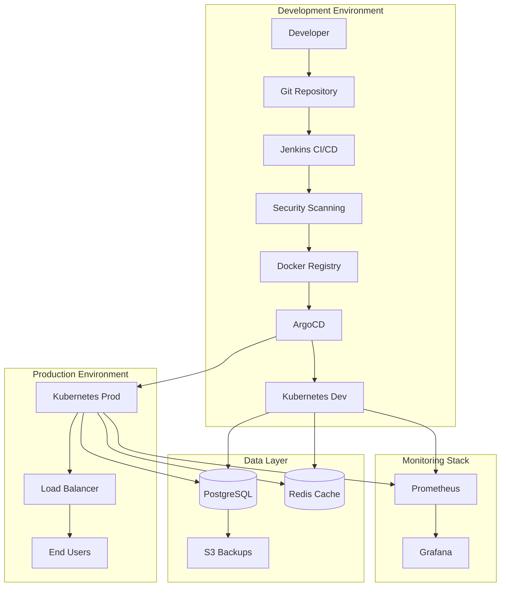
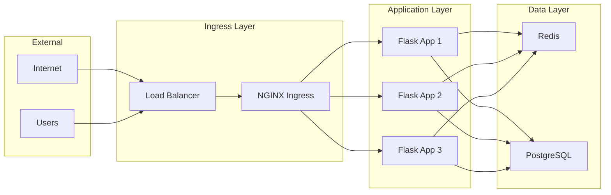
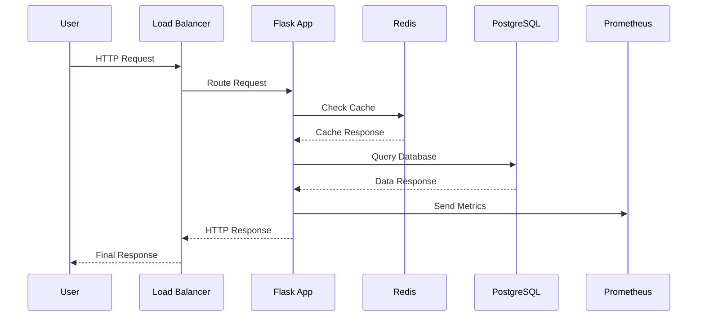

# Architecture Overview

## System Architecture

## Component Details

### CI/CD Pipeline

**Jenkins Pipeline Stages:**
1. **Checkout** - Pull source code from Git
2. **Test** - Run pytest test suite
3. **Build** - Create Docker image
4. **Security Scan** - Trivy vulnerability assessment
5. **Push** - Upload image to registry
6. **Deploy** - Update Kubernetes manifests
7. **Verify** - Health checks and validation

### GitOps Workflow

**ArgoCD manages deployments through:**
- Continuous monitoring of Git repository
- Automatic synchronization of Kubernetes state
- Rollback capabilities for failed deployments
- Multi-environment management (dev/staging/prod)

### Security Layers

1. **Container Security**
   - Non-root user execution
   - Minimal base images
   - Regular vulnerability scanning

2. **Kubernetes Security**
   - RBAC implementation
   - Network policies
   - Pod security standards

3. **Pipeline Security**
   - Credential management
   - Signed container images
   - Security gate checks

### Monitoring and Observability

**Prometheus Metrics:**
- Application performance metrics
- Infrastructure resource usage
- Custom business metrics
- Alert rule definitions

**Grafana Dashboards:**
- System overview dashboard
- Application performance dashboard
- Infrastructure monitoring dashboard
- Alert management interface

## Network Architecture

## Deployment Strategy

### Blue-Green Deployment

1. **Blue Environment** - Current production
2. **Green Environment** - New version deployment
3. **Traffic Switch** - Instant cutover
4. **Rollback** - Quick revert if issues

### Rolling Updates

- Zero-downtime deployments
- Gradual instance replacement
- Health check validation
- Automatic rollback on failure

## Data Flow

## Scalability Considerations

### Horizontal Scaling
- Multiple Flask application replicas
- Load balancing across instances
- Auto-scaling based on metrics

### Vertical Scaling
- Resource limit adjustments
- Performance optimization
- Memory and CPU tuning

### Database Scaling
- Read replicas for PostgreSQL
- Redis clustering for cache
- Connection pooling

## Disaster Recovery

### Backup Strategy
- Automated PostgreSQL backups
- S3 storage for backup retention
- Point-in-time recovery capability

### Recovery Procedures
1. Infrastructure restoration
2. Database recovery from backup
3. Application redeployment via GitOps
4. Service validation and testing

## Security Architecture

### Defense in Depth
1. **Network Security** - Firewalls, VPCs
2. **Container Security** - Image scanning, runtime protection
3. **Application Security** - Input validation, authentication
4. **Data Security** - Encryption at rest and in transit

### Compliance
- Security scanning in CI/CD
- Vulnerability management
- Access control and auditing
- Regular security assessments