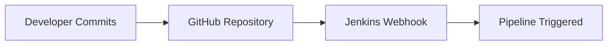
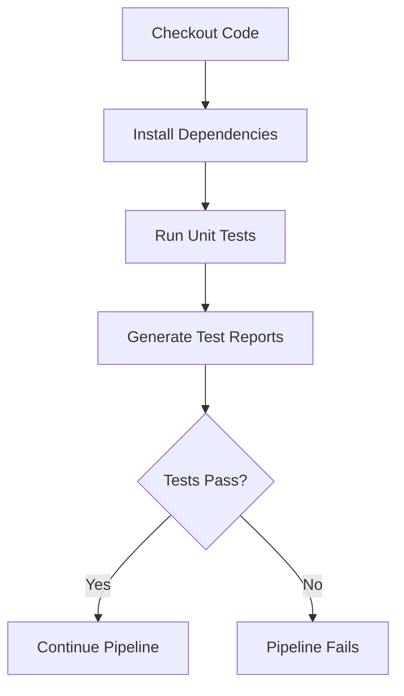
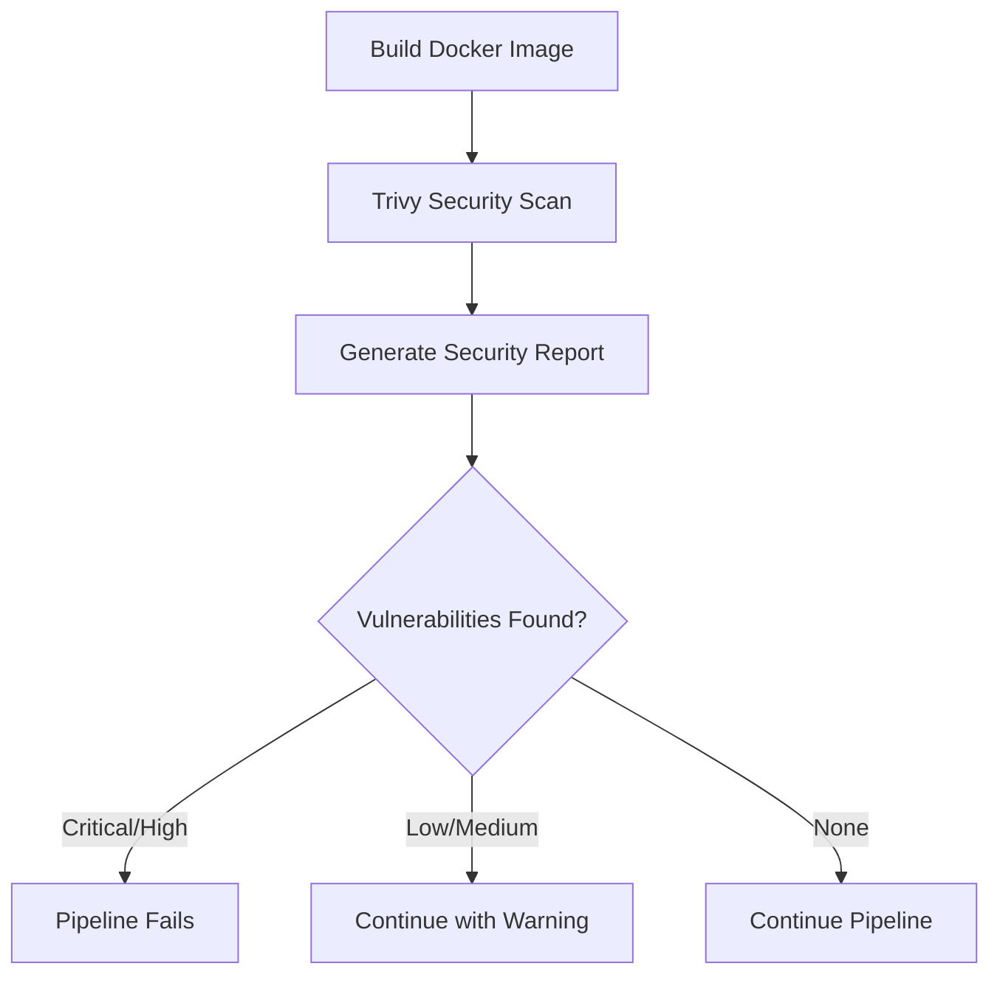
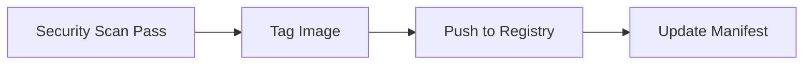
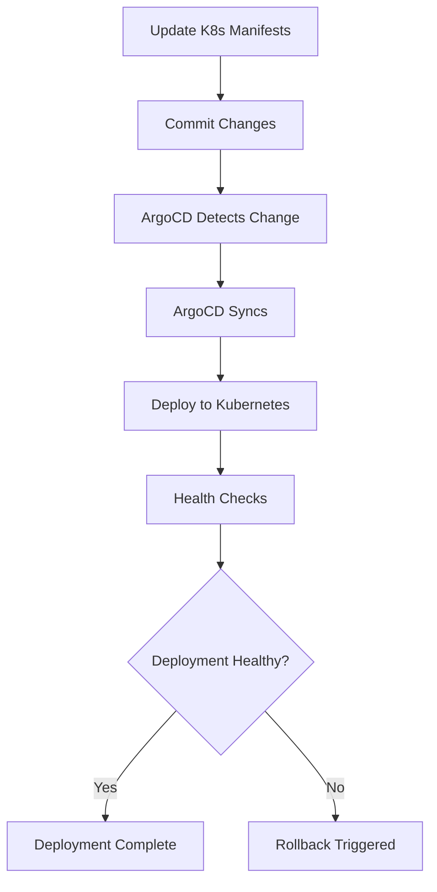
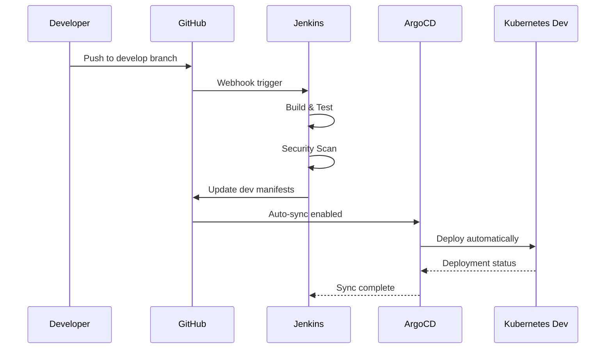
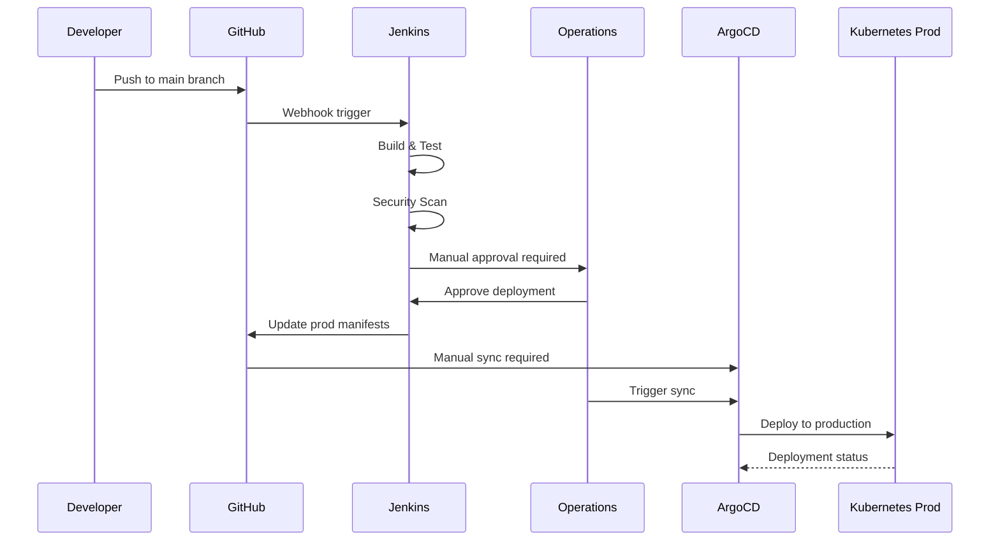
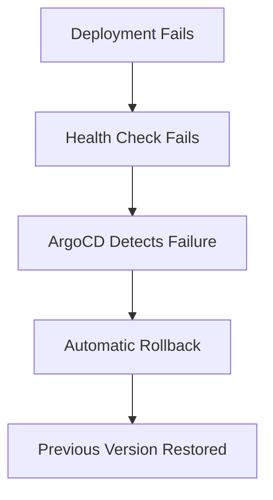
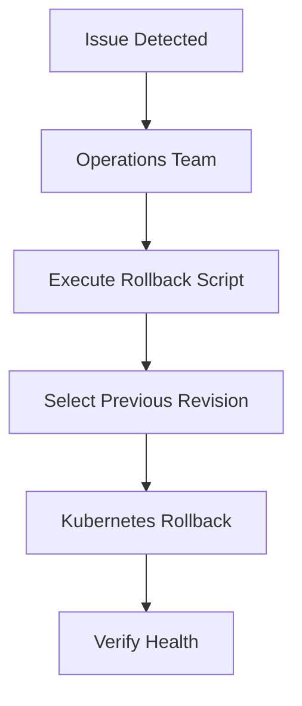
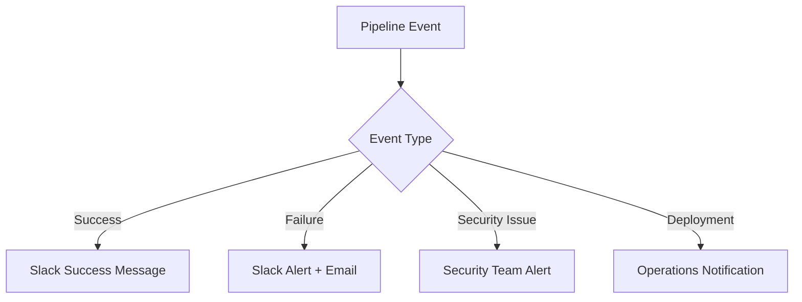

# Pipeline Flow Documentation

## CI/CD Pipeline Overview

This document describes the complete flow of our DevOps pipeline from code commit to production deployment.

## Pipeline Stages

### 1. Code Commit & Trigger



**Actions:**
- Developer pushes code to GitHub
- Webhook triggers Jenkins pipeline
- Pipeline starts with latest commit

### 2. Build & Test Phase



**Actions:**
- Checkout source code from Git
- Install Python dependencies
- Execute pytest test suite
- Generate JUnit test reports
- Fail pipeline if tests don't pass

### 3. Security Scanning



**Actions:**
- Build Docker image with multi-stage build
- Scan image for vulnerabilities using Trivy
- Generate security report
- Block deployment for critical vulnerabilities

### 4. Image Registry



**Actions:**
- Tag image with build number and commit hash
- Push to Docker registry (ECR/DockerHub)
- Update Kubernetes deployment manifests

### 5. GitOps Deployment



**Actions:**
- Jenkins updates Kubernetes manifests with new image tag
- Commits changes back to Git repository
- ArgoCD detects manifest changes
- ArgoCD synchronizes cluster state
- Kubernetes performs rolling deployment
- Health checks validate deployment

## Environment-Specific Flows

### Development Environment



### Production Environment



## Rollback Procedures

### Automatic Rollback



### Manual Rollback



## Monitoring Integration

### Pipeline Metrics

- Build success/failure rates
- Build duration trends
- Test coverage metrics
- Security vulnerability counts
- Deployment frequency

### Application Metrics

- Response time percentiles
- Error rates by endpoint
- Request volume patterns
- Resource utilization
- Database performance

## Notification Flow



## Quality Gates

### Code Quality
- Unit test coverage > 80%
- No critical SonarQube issues
- Code review approval required

### Security
- No critical/high vulnerabilities
- Container security best practices
- Secrets management compliance

### Performance
- Build time < 10 minutes
- Deployment time < 5 minutes
- Health check response < 30 seconds

## Pipeline Configuration

### Branch Strategy

| Branch | Environment | Auto-Deploy | Approval Required |
|--------|-------------|-------------|-------------------|
| develop | dev | Yes | No |
| main | prod | No | Yes |
| feature/* | - | No | - |

### Deployment Strategy

| Environment | Strategy | Replicas | Resources |
|-------------|----------|----------|-----------|
| dev | Rolling Update | 2 | Minimal |
| staging | Blue-Green | 2 | Medium |
| prod | Blue-Green | 3+ | Full |

## Troubleshooting Guide

### Common Pipeline Failures

1. **Test Failures**
   - Check test logs in Jenkins
   - Verify test environment setup
   - Review recent code changes

2. **Security Scan Failures**
   - Review Trivy report
   - Update base images
   - Apply security patches

3. **Deployment Failures**
   - Check ArgoCD sync status
   - Verify Kubernetes resources
   - Review application logs

4. **Health Check Failures**
   - Check application startup logs
   - Verify database connectivity
   - Review resource constraints

### Recovery Procedures

1. **Pipeline Recovery**
   ```bash
   # Restart failed build
   curl -X POST http://jenkins:8080/job/pipeline/build
   ```

2. **Deployment Recovery**
   ```bash
   # Manual rollback
   ./scripts/rollback.sh prod 2
   ```

3. **Data Recovery**
   ```bash
   # Restore from backup
   ./scripts/restore-postgres.sh prod latest
   ```